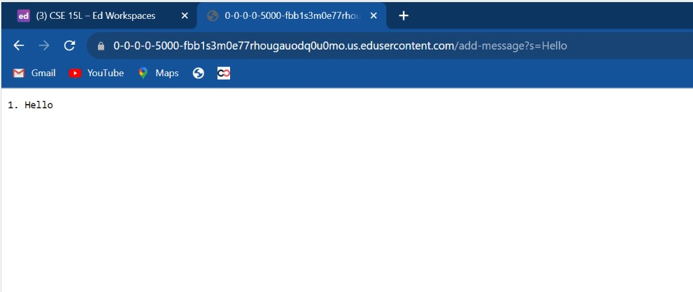
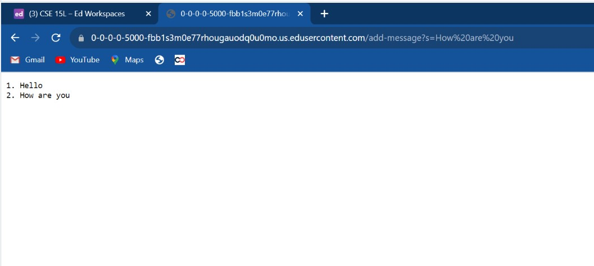
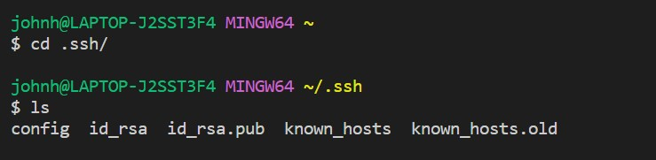
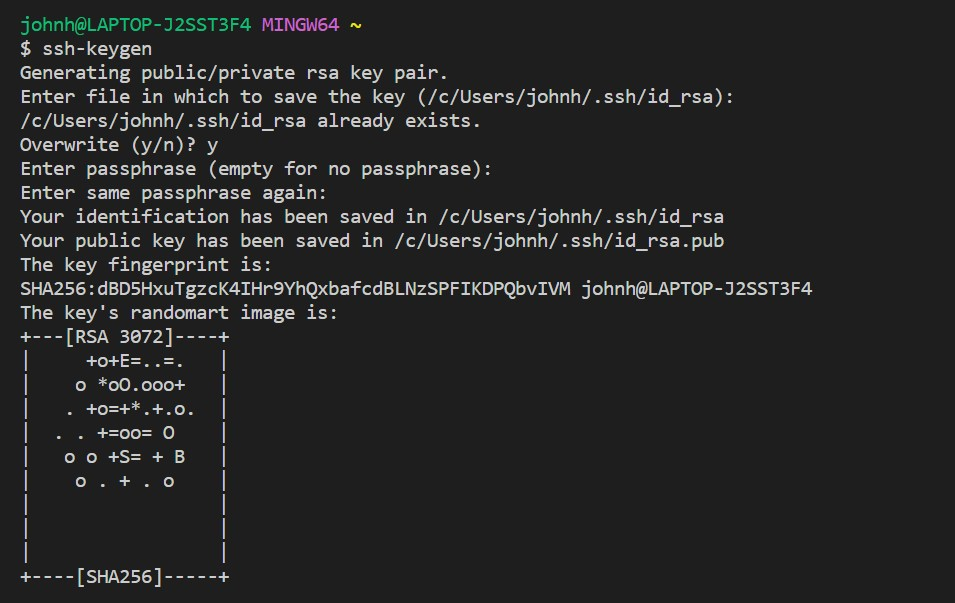
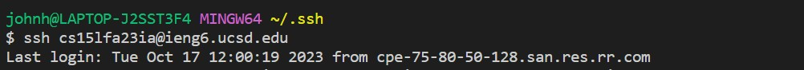

# Lab Report 2

```
import java.io.IOException;
import java.net.URI;

class Handler implements URLHandler {
    // The one bit of state on the server: a number that will be manipulated by
    // various requests.
    String str = "";
    int num = 1;

    public String handleRequest(URI url) {
        if (url.getPath().equals("/search")) {
            String[] parameters = url.getQuery().split("=");
            if (parameters[0].equals("s")) {
                if(parameters[1].equals("app")) {
                    return String.format("John's String:%s", str);
                }
            }
        } else {
            if (url.getPath().contains("/add-message")) {
                String[] parameters = url.getQuery().split("=");
                if (parameters[0].equals("s")) {
                    str += String.valueOf(num);
                    str += ". ";
                    str += parameters[1];
                    str += "\n";
                    num++;
                    return str.replace('+', ' ');
                }
            }
            return "404 Not Found!";
        }
        return str;
    }
}

class SearchServer {
    public static void main(String[] args) throws IOException {
        if(args.length == 0){
            System.out.println("Missing port number! Try any number between 1024 to 49151");
            return;
        }

        int port = Integer.parseInt(args[0]);

        Server.start(port, new Handler());
    }
}
```


- The method handleRequest is called which returns a value of String type. The purpose of the handleRequest method is to take in a url of type URI and add it to a list of Strings which is later returned.
- The relevant argument to the handleRequest method is URI url. This method essentially takes the argument url and looks for the path. In this case when adding Hello to the list of string, "url.getPath().contains("/add-message")" is called since the path doesn't contian /search but does contain /add-message. Since checking this path is true for the case of add message, the query is checked. This includes checking split is "=" and the parameter 0 is "s" since adding a string requires you to follow the form "/add-message?s=". Finally the string at parameter 1 which is whatever is after "=" is placed at the end of the str to be returned later.
- When adding a new string there are values of num and String to take into account. The num values keeps track of the number of strings that have already been added starting from 1. When the browser is first openned, the value is always 1. Everytime you add a string using /add-message?s=", the num value gets incremented since you are adding a new string. Another value to keep track of is str. str starts off when the browser is first openned as an empty string "". When a new string is added the value of num is pushed back following a "." and then the new string which is whatever is after "=" in the url. Finally "\n" is added to go to the next line after adding a string to the list. The additions to num and str will keep going until the port is closed and reset. In this case values of num and str will be 0 and "" respectively.


- The methods for this specific request is the same for the specific request of Hello. Take in a URI value and add whatever string is in the query to the end of the list.
- The relevant argument to the handleRequest method is still URI url. The method looks for the matching path and query. If all match, then add the string to the list.
- The values of num and str still start off the same as the Hello request. num starts off at 0 and str starts off as an empty string "". The changes to the values are also the same. Whenever a string is added, the num value gets incremented since the count of strings on the list goes up by one for adding a new string. The new string value from the url is added onto the end of the str value including the the num count and newline "\n". However a key difference between the Hello request and  the request in this images is that we are now adding a phrase "How are you" which includes spaces. URLs are not allowed to have spaces. To fix this problem and ensure that the URL is valid, all spaces are replaced with + signs. This poses a problem for us now because instead of get "2. How are you" we get "2. How+are+you". A simple fix of this problem is to simply at the end before returning the string str value, we just replace all plus signs "+" with spaces " ".





- Something that I learned in lab 2 was how to create a simple search engine. Before I had an idea about how the URL worked. I had a basic idea on how the URL can be related to a what you put in a search bar, but now I actually know how to implement it. I was able to learn about how to implement a URL handler in Java which really clears up a few of my unknowns about URLs in the past.
